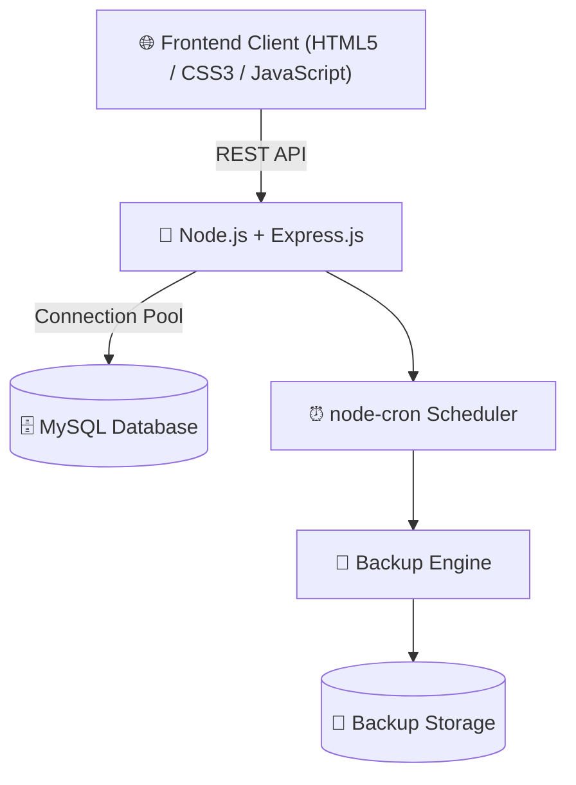

# 🛡️ Database Backup Monitoring System (BMS)

[](https://nodejs.org/)
[](https://expressjs.com/)
[](https://www.mysql.com/)
[](https://developer.mozilla.org/en-US/docs/Web/JavaScript)
[](LICENSE)

An enterprise-grade **Database Backup Monitoring & Management System (BMS)** designed for mission-critical database environments (Oracle, MySQL, PostgreSQL, MS SQL). The system provides centralized real-time monitoring, automated cron-based backup scheduling, instant manual backup execution, comprehensive audit reporting, and secure management of database backup operations from a single dashboard.

---

## 🎥 Demo Video

Watch the complete working demonstration of the project here:

▶️ **Project Demo:**  
https://drive.google.com/file/d/1wsdVdKZs5wq39RMFAsrHxaMk0B9-5Xuz/view?usp=drive_link

The demo covers:

- 🔐 User Authentication
- 🖥️ Dashboard Overview
- 📊 Database Instance Monitoring
- ➕ Add Database Instance
- 💾 Manual Backup Execution
- ⏰ Automated Backup Scheduling
- 📜 Backup History
- 📈 Dashboard Analytics
- ☁️ Deployment Overview

---

## 🌟 Key Features

- 🖥️ **Centralized Dashboard**
  - Monitor all database instances from a single interface.
  - Real-time database health monitoring.
  - View backup status, storage usage, and connection information.

- ⏱️ **Automated Backup Scheduling**
  - Cron-based scheduler using **node-cron**.
  - Configure periodic backups.
  - Automatic execution without manual intervention.

- ⚡ **Manual Backup Execution**
  - Trigger backups instantly.
  - Generate timestamped backup files.
  - Real-time execution logs.

- 📊 **Backup Analytics & Reports**
  - Backup history.
  - Backup duration.
  - Backup size.
  - Success/Failure reports.
  - Storage location tracking.

- 🔌 **Multi-Database Ready**
  - Oracle
  - MySQL
  - PostgreSQL
  - Microsoft SQL Server

- 🔐 **Authentication & Security**
  - Secure login system.
  - Protected API routes.
  - Environment-based credential management.

- ☁️ **Cloud Ready**
  - Vercel Deployment
  - Cloud MySQL Support
  - Connection Pooling
  - Serverless APIs

---

## 🏗️ System Architecture



---

# 🛠️ Technology Stack

| Layer | Technologies |
|--------|--------------|
| **Frontend** | HTML5, CSS3, JavaScript (ES6+) |
| **Backend** | Node.js, Express.js |
| **Database** | MySQL 8.0, mysql2 |
| **Scheduling** | node-cron |
| **Deployment** | Vercel |
| **Environment** | dotenv |
| **Middleware** | cors, express.json() |

---

# 📁 Repository Structure

```text
Backup-Monitoring-System/
│
├── backend/
│   ├── config/
│   │   └── db.js
│   │
│   ├── controllers/
│   │   ├── authController.js
│   │   ├── backupController.js
│   │   ├── dashboardController.js
│   │   ├── instanceController.js
│   │   └── scheduleController.js
│   │
│   ├── routes/
│   │   ├── authRoutes.js
│   │   ├── backupRoutes.js
│   │   ├── dashboardRoutes.js
│   │   ├── instanceRoutes.js
│   │   └── scheduleRoutes.js
│   │
│   ├── services/
│   │   ├── backupRunner.js
│   │   └── backupScheduler.js
│   │
│   ├── package.json
│   ├── server.js
│   └── .env
│
├── css/
│   └── style.css
│
├── html/
│   ├── login.html
│   ├── dashboard.html
│   ├── index.html
│   ├── instances.html
│   ├── add-instance.html
│   ├── backup-history.html
│   ├── backup-now.html
│   └── configure-backup.html
│
├── js/
│   └── app.js
│
├── bms.sql
├── vercel.json
└── README.md
```

---

# 🚀 REST API Endpoints

## 🔑 Authentication

| Method | Endpoint | Description |
|---------|----------|-------------|
| POST | `/api/login` | User Login |

---

## 🖥️ Database Instances

| Method | Endpoint | Description |
|---------|----------|-------------|
| GET | `/api/instances` | Get All Instances |
| POST | `/api/instances` | Add New Instance |
| GET | `/api/instances/:id` | Get Instance |
| DELETE | `/api/instances/:id` | Delete Instance |

---

## 💾 Backup Management

| Method | Endpoint | Description |
|---------|----------|-------------|
| GET | `/api/backups` | Backup History |
| POST | `/api/backups/run` | Run Manual Backup |

---

## 📊 Dashboard

| Method | Endpoint | Description |
|---------|----------|-------------|
| GET | `/api/dashboard/stats` | Dashboard Statistics |

---

## ⏰ Scheduling

| Method | Endpoint | Description |
|---------|----------|-------------|
| GET | `/api/schedules` | Get Schedules |
| POST | `/api/schedules` | Create Schedule |

---

# 💻 Local Installation

## Prerequisites

- Node.js (v18 or above)
- MySQL Server (v8+)

---

## Clone Repository

```bash
git clone https://github.com/milandhal/Backup-Monitoring-System.git

cd Backup-Monitoring-System
```

---

## Create Database

```sql
CREATE DATABASE bms;
```

Import the SQL file:

```bash
mysql -u root -p bms < bms.sql
```

---

## Configure Environment Variables

Create a `.env` file inside the **backend** folder.

```env
DB_HOST=localhost
DB_USER=root
DB_PASSWORD=your_password
DB_NAME=bms
DB_PORT=3306

PORT=5000
```

---

## Install Dependencies

```bash
cd backend

npm install
```

---

## Run the Server

```bash
npm run dev
```

Server will start at

```
http://localhost:5000
```

---

# ☁️ Deploy on Vercel

This project is fully configured for **Vercel Serverless Deployment**.

### Steps

1. Fork or Clone the Repository.

2. Push the project to GitHub.

3. Import Repository into Vercel.

4. Add Environment Variables.

```
DB_HOST

DB_USER

DB_PASSWORD

DB_NAME

DB_PORT
```

5. Deploy.

---

# 📊 Project Highlights

✅ Enterprise Dashboard

✅ Backup Monitoring

✅ Manual Backup Trigger

✅ Automated Scheduler

✅ Backup Reports

✅ Instance Management

✅ Authentication System

✅ MySQL Connection Pool

✅ REST APIs

✅ Vercel Deployment Ready

---

# 🔮 Future Enhancements

- Email Notifications
- SMS Alerts
- AWS S3 Backup Storage
- Azure Blob Storage
- Google Drive Backup
- Backup Compression
- Backup Encryption
- Docker Support
- Kubernetes Deployment
- Role-Based Access Control (RBAC)
- Backup Restore Functionality
- Real-Time WebSocket Monitoring

---

# 📄 License

This project is licensed under the **ISC License**.

---

# 👨‍💻 Author

## Milan Dhal

- **GitHub:** https://github.com/milandhal
- **Project Demo:** https://drive.google.com/file/d/1wsdVdKZs5wq39RMFAsrHxaMk0B9-5Xuz/view?usp=drive_link

---

## ⭐ Support

If you found this project helpful, please consider giving it a **⭐ Star** on GitHub.

It motivates future development and improvements.

---
