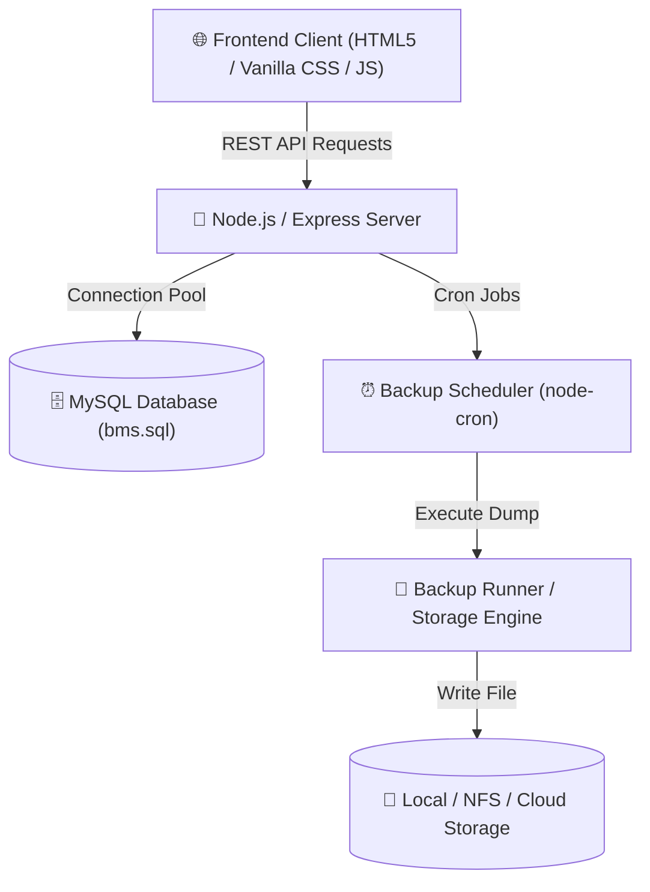

# 🛡️ Database Backup Monitoring System (BMS)

[](https://nodejs.org/)
[](https://expressjs.com/)
[](https://www.mysql.com/)
[](https://developer.mozilla.org/en-US/docs/Web/JavaScript)
[](LICENSE)

An enterprise-grade **Database Backup Monitoring & Management System (BMS)** designed for mission-critical database environments (Oracle, MySQL, PostgreSQL, MS SQL). Provides centralized real-time monitoring, automated cron-based backup scheduling, instant manual backup triggers, and detailed system audit reporting.

---

## 🌟 Key Features

- 🖥️ **Centralized Dashboard**: Real-time status monitoring of database instances, connection health, backup sizes, and last downtime timestamps.
- ⏱️ **Automated Cron Scheduler**: Integrated backup scheduler powered by `node-cron` to execute periodic database dumps without manual intervention.
- ⚡ **Instant Manual Backups**: Execute manual database backups on-demand with instant execution logs and timestamped backup artifact generation.
- 📊 **Analytics & Reporting**: Complete history of backup durations, file sizes, storage locations, and success/failure logs.
- 🔌 **Multi-Database Support**: Infrastructure setup prepared for heterogeneous database environments (Oracle, MySQL, PostgreSQL).
- 🔐 **Authentication & Security**: Secure user login, session management, and environment credential protection.
- ☁️ **Serverless & Cloud Ready**: Pre-configured with connection pooling and routing for seamless deployment on platforms like Vercel and cloud database hosts.

---

## 🏗️ System Architecture



---

## 🛠️ Technology Stack

| Layer | Technologies |
| :--- | :--- |
| **Frontend** | Vanilla HTML5, Custom CSS3 (Glassmorphism & Responsive Grid), JavaScript (ES6+) |
| **Backend** | Node.js, Express.js (v5), `node-cron`, `cors`, `dotenv` |
| **Database** | MySQL 8.0, `mysql2` (Connection Pooling enabled) |
| **Deployment** | Vercel Serverless Functions (`@vercel/node`), Cloud MySQL (Aiven / TiDB / Railway) |

---

## 📁 Repository Structure

```text
Backup-Monitoring-System/
├── backend/
│   ├── config/
│   │   └── db.js               # MySQL Connection Pool configuration
│   ├── controllers/            # Route handler logic (auth, backups, instances, etc.)
│   ├── routes/                 # Express API endpoints
│   ├── services/
│   │   ├── backupRunner.js     # Manual & scheduled backup execution engine
│   │   └── backupScheduler.js  # Node-cron scheduler initialization
│   ├── .env                    # Environment variables configuration
│   ├── package.json            # Node.js dependencies and scripts
│   └── server.js               # Express application entry point & Serverless export
├── css/
│   └── style.css               # Core styling tokens & UI component CSS
├── html/
│   ├── index.html              # Main Landing / Dashboard Overview
│   ├── dashboard.html          # Detailed Instance Monitoring Matrix
│   ├── instances.html          # Managed Database Instances List
│   ├── add-instance.html      # Add New Database Instance Form
│   ├── backup-history.html     # Historical Backup Audit Log
│   ├── backup-now.html        # Manual Backup Execution Trigger
│   ├── configure-backup.html   # Automated Backup Schedule Manager
│   └── login.html              # System User Authentication
├── js/
│   └── app.js                  # Frontend State Management & API Sync Engine
├── bms.sql                     # Database Schema Dump & Sample Records
├── vercel.json                 # Vercel Deployment & Route Rewrites Configuration
└── README.md                   # System Documentation
```

---

## 🚀 REST API Endpoints

### 🔑 Authentication
| Method | Endpoint | Description |
| :--- | :--- | :--- |
| `POST` | `/api/login` | Authenticate user credentials |

### 🖥️ Database Instances
| Method | Endpoint | Description |
| :--- | :--- | :--- |
| `GET` | `/api/instances` | Fetch all registered database instances |
| `POST` | `/api/instances` | Register a new database instance |
| `GET` | `/api/instances/:id` | Get instance details by ID |
| `DELETE` | `/api/instances/:id` | Remove a database instance |

### 💾 Backup Management
| Method | Endpoint | Description |
| :--- | :--- | :--- |
| `GET` | `/api/backups` | Retrieve complete backup audit history |
| `POST` | `/api/backups/run` | Trigger immediate manual backup |

### ⏰ Scheduling & Dashboard
| Method | Endpoint | Description |
| :--- | :--- | :--- |
| `GET` | `/api/dashboard/stats` | Retrieve aggregate system health & backup metrics |
| `GET` | `/api/schedules` | Get active automated backup schedules |
| `POST` | `/api/schedules` | Create or update a backup cron schedule |

---

## 💻 Local Setup & Installation

### Prerequisites
- [Node.js](https://nodejs.org/) (v18.x or higher)
- [MySQL Server](https://dev.mysql.com/downloads/mysql/) (v8.0 or higher)

### 1. Clone the Repository
```bash
git clone https://github.com/milandhal/Backup-Monitoring-System.git
cd Backup-Monitoring-System
```

### 2. Set Up Database Schema
Import `bms.sql` into your local MySQL server:
```bash
mysql -u root -p -e "CREATE DATABASE bms;"
mysql -u root -p bms < bms.sql
```

### 3. Configure Environment Variables
Navigate to the `backend/` directory and update `.env`:
```env
DB_HOST=localhost
DB_USER=root
DB_PASSWORD=your_mysql_password
DB_NAME=bms
DB_PORT=3306
PORT=5000
```

### 4. Install Dependencies & Start Server
```bash
cd backend
npm install
npm run dev
```

The application backend will start on `http://localhost:5000` and serve the frontend at `http://localhost:5000/`.

---

## ☁️ Cloud Deployment (Vercel)

This repository includes a `vercel.json` file optimized for Vercel Serverless Functions.

1. **Push your code to GitHub**.
2. **Import the repository into Vercel**.
3. **Configure Environment Variables** on Vercel:
   - `DB_HOST`: Cloud MySQL Host (Aiven, TiDB, Railway)
   - `DB_USER`: Database User
   - `DB_PASSWORD`: Database Password
   - `DB_NAME`: Database Name (`bms`)
   - `DB_PORT`: `3306`
4. Click **Deploy**.

---

## Author

Milan Dhal

